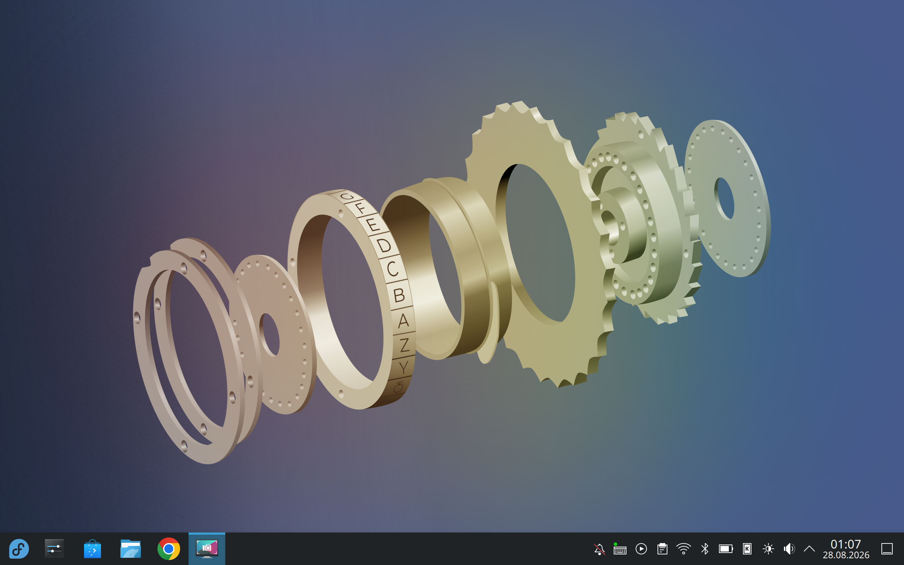

# Fedora Rawhide for Xiaomi Pad 5

<p align="center">
  
</p>

**Reproducible Fedora Rawhide images and device integration for Xiaomi Pad 5
(`nabu`).**

[](https://fedoraproject.org/)
[](https://developer.arm.com/Architectures/A-Profile%20Architecture)
[](Nabu-Fedora-Rawhide-Builder.sh)
[](https://copr.fedorainfracloud.org/coprs/mcc45tr/nabu-linux/)
[](LICENSE)

This repository provides a container-isolated build pipeline for Fedora
Rawhide AArch64 root filesystems, Unified Kernel Images (UKIs), boot entries,
and FAT32 EFI System Partition (ESP) images tailored for Xiaomi Pad 5.

**[COPR packages](https://copr.fedorainfracloud.org/coprs/mcc45tr/nabu-linux/)**
· **[Hardware status](NABU-HARDWARE-STATUS.md)**
· **[Plasma Mobile profile](docs/PLASMA-MOBILE-PROFILE.md)**
· **[License](LICENSE)**

> [!WARNING]
> **Unofficial community project**
>
> This is **not an official Fedora image or Fedora Project product**. The
> project is not endorsed by or affiliated with the Fedora Project, Red Hat,
> Xiaomi, or any other hardware or software vendor.
>
> Unlocking a bootloader, changing partitions, or flashing images can erase
> data or render a device unbootable. Back up all important data, preserve a
> known-good Android and Linux recovery path, read the complete procedure, and
> proceed entirely at your own risk.

## Overview

The single entry point, `Nabu-Fedora-Rawhide-Builder.sh`, provides an auditable
pipeline for:

- resolving current Fedora Rawhide AArch64 packages and compose metadata;
- validating a coherent Nabu kernel, firmware, boot, and device RPM set;
- building a reusable core and independent desktop variants;
- generating initramfs images, UKIs, boot entries, and a FAT32 ESP;
- signing boot artifacts and validating explicit UEFI trust inputs;
- verifying package state, filesystem health, boot artifacts, and checksums;
- producing structured manifests, reports, logs, and failure diagnostics.

The builder produces filesystem and EFI artifacts. It does not create an ISO,
Android `boot.img`, recovery image, or whole-disk GPT image. Input projects and
RPM trees are mounted read-only; builder-owned `work/`, `cache/`, and `output/`
directories are writable.

| Area | Support |
| --- | --- |
| Target | Xiaomi Pad 5 (`nabu`), AArch64 |
| Distribution | Fedora Rawhide |
| Desktops | KDE Plasma, Plasma Mobile, GNOME, GNOME Mobile, Phosh, headless |
| Filesystems | Ext4 and Btrfs |
| Boot | UKI with systemd-boot, GRUB, Limine, or an existing ESP |
| Build isolation | Rootless Podman by default |
| Package channel | [mcc45tr/nabu-linux COPR](https://copr.fedorainfracloud.org/coprs/mcc45tr/nabu-linux/) |

## Project status

**Last reviewed:** 2026-08-26

Fedora Rawhide and the Nabu device stack change continuously. In the hardware
checklist, `[x]` means the feature passed at least one recorded physical test
campaign. It does not certify every newly generated image. Source, package,
image, and physical-device results are reported as separate validation layers.

### Kernel development tracks

| Kernel line | Role | Status | Validation boundary |
| --- | --- | --- | --- |
| [Linux 6.17](https://github.com/MCC45TR/nabu-linux-kernel/tree/6.17.0) | Current Nabu hardware and release line | **Active** | COPR, image, and physical-device validation are maintained per release candidate. |
| [Linux 7.2](https://github.com/MCC45TR/nabu-linux-kernel/tree/7.2.0) | Next-generation upstream port | **WIP / Alpha** | Source, DTB, module, and alpha-package work is in progress. It is not the default kernel; full image integration and physical regression testing remain pending. |

Linux 7.2 development is isolated in the
[SENEMOS Nabu kernel alpha COPR](https://copr.fedorainfracloud.org/coprs/mcc45tr/senemos-nabu-kernel-alpha/)
and is not promoted into the current release channel without recorded physical
acceptance.

### Builder capabilities

- [x] Rootless Podman workflow by default
- [x] Repository, dependency, architecture, RPM, and signing-key preflight
- [x] Ext4 and Btrfs image generation
- [x] KDE Plasma, KDE Mobile, GNOME, GNOME Mobile (when available), Phosh, and
      no-desktop profiles
- [x] Core-first builds and validated core reuse
- [x] systemd-boot, GRUB, Limine, and existing-ESP modes
- [x] UKI generation and optional Secure Boot signing
- [x] Atomic artifact publication, SHA-256 manifests, and focused failure reports
- [x] UKI and ESP structure, identity, and checksum validation
- [ ] Automatic stage-level resume after an interrupted build
- [ ] Stable release channel independent of Rawhide changes

### Working on a physical Xiaomi Pad 5

- [x] UEFI Linux boot with retained Android and known-good Linux fallback entries
- [x] Internal DSI display at 60 Hz and 120 Hz
- [x] Ten-contact touchscreen and hardware volume buttons
- [x] Freedreno OpenGL acceleration and Turnip Vulkan
- [x] Wi-Fi connectivity and bounded reconnect after suspend
- [x] Bluetooth HID pairing and pointer input
- [x] Ambient-light sensing and automatic brightness
- [x] Accelerometer-based automatic rotation
- [x] Magnetic-cover detection with the safe lock-screen policy
- [x] Basic USB-C charging and battery telemetry
- [x] Bounded s2idle suspend/resume with display and sensor recovery helpers

See [Nabu hardware status](NABU-HARDWARE-STATUS.md) for the maintained public
status summary. Every release candidate still requires a fresh physical test.

### TODO / known limitations

- [ ] Requalify each release candidate on physical hardware before promotion
- [ ] Complete four-speaker routing; the current physical baseline does not
      provide correct independent output from all four speakers
- [ ] Complete internal microphone recording validation
- [ ] Add and validate double-tap-to-wake support
- [ ] Qualify Smart Pen input, keyboard accessories, and stylus charging across
      attach/detach and suspend cycles
- [ ] Finish camera bring-up and userspace integration
- [ ] Validate long-duration suspend residency, wake sources, and battery drain;
      current suspend is s2idle, not certified deep sleep
- [ ] Correct charging-status telemetry and qualify higher-current charging with
      an external USB-C power meter and thermal safeguards
- [ ] Qualify Bluetooth audio, USB OTG storage/HID/hubs/audio, and DisplayPort
- [ ] Resolve EL2 firmware/UEFI handoff before claiming KVM support
- [ ] Complete repeated cold-boot, rollback, and Android-return acceptance
      tests for each release candidate

## Package repository

Nabu kernel and integration packages are published through the
**[mcc45tr/nabu-linux COPR project](https://copr.fedorainfracloud.org/coprs/mcc45tr/nabu-linux/)**.
The builder validates the selected RPM family as a coherent set before image
creation; a successful COPR build alone does not establish physical hardware
compatibility.

## Quick start

### Host requirements

- Linux host with Bash and GNU core utilities
- Podman with working rootless containers
- Network access to Fedora Rawhide repositories
- Native AArch64, registered AArch64 binfmt, or an explicit QEMU setup for real
  package scriptlets
- Local Nabu kernel, firmware, configuration, and boot RPMs
- FUSE/libguestfs support for normal rootless image creation

An x86_64 host without binfmt can still run the complete repository/RPM
preflight with DNF5 `--forcearch=aarch64`; real AArch64 RPM scriptlets remain
fail-closed in that configuration.

### Clone and inspect

```bash
git clone https://github.com/MCC45TR/Nabu-Fedora-Rawhide-Builder.git
cd Nabu-Fedora-Rawhide-Builder
chmod +x Nabu-Fedora-Rawhide-Builder.sh

./Nabu-Fedora-Rawhide-Builder.sh doctor
./Nabu-Fedora-Rawhide-Builder.sh --dry-run
```

`doctor` checks host tools, Podman, storage, architecture, FUSE, runtime paths,
and conventional Secure Boot input paths. The dry-run starts Fedora Rawhide in
Podman and performs real compose, repository, dependency, local-RPM, kernel,
and Secure Boot preflight without creating an image.

## Build examples

### KDE Plasma with strict Secure Boot validation

Use a signing certificate already enrolled in the target device's UEFI trust
database:

```bash
./Nabu-Fedora-Rawhide-Builder.sh \
  --desktop kde-plasma \
  --filesystem ext4 \
  --shell bash \
  --secure-boot on \
  --sb-key /secure/db.key \
  --sb-cert /secure/db.crt \
  --uefi-trusted-cert /secure/db.crt \
  --non-interactive
```

Private-key paths and contents are never written to reports. Manifests contain
only certificate fingerprints. Never commit private keys to this repository.

### Build all supported desktop variants

```bash
./Nabu-Fedora-Rawhide-Builder.sh \
  --desktop all \
  --filesystem ext4 \
  --keep-core
```

A failed core/EFI gate stops the build. With `--desktop all`, independently
failed desktop variants are reported while verified variants can still be
published with exit code `20`.

### Plasma Mobile

```bash
./Nabu-Fedora-Rawhide-Builder.sh \
  --desktop kde-mobile \
  --filesystem ext4
```

The Mobile profile uses Fedora's stock Plasma Mobile, KWin, and Plasma Login
Manager packages; it does not ship a forked KWin. See the
[Plasma Mobile profile notes](docs/PLASMA-MOBILE-PROFILE.md).

Run `./Nabu-Fedora-Rawhide-Builder.sh --help` for all profile, filesystem,
bootloader, repository, cache, signing, logging, and safety options.

## Defaults

| Setting | Default |
| --- | --- |
| Desktop | `kde-plasma` |
| Filesystem | `ext4` |
| Shell | `bash` |
| Secure Boot | `on` |
| Bootloader | `systemd-boot` |
| Fedora parity | `strict` |
| Core / final image size | `6G` / `12G` |
| ESP size | `350M` |
| Compression | Zstandard level `10` |
| Locale / timezone / keyboard | `en_US.UTF-8` / `UTC` / `us` |

The UKI keeps `fbcon=rotate:1` in every build mode. The default verbose mode
keeps first-boot messages visible; release mode adds `quiet splash`.
`--debug` and `--trace` control builder-side diagnostic logging.

## Build workflow

1. Validate the host, container runtime, architecture, storage, and signing
   inputs.
2. Resolve official Fedora Rawhide compose and package metadata.
3. Inventory and validate the local Nabu RPM family.
4. Build and validate a common Fedora core image.
5. Generate the initramfs, UKI, boot entries, and ESP.
6. Clone the validated core for each selected desktop/filesystem variant.
7. Run package, filesystem, boot, and profile-specific release gates.
8. Atomically publish artifacts, reports, metadata, logs, and SHA-256 sums.

Unsafe automatic `--resume` is deliberately rejected. Use a fingerprinted
`--reuse-core` or an explicitly validated `--from-core` image instead.

## Output layout

Each run is written to `output/rawhide-YYYYMMDD-HHMMSS-ID/` and can contain:

```text
output/rawhide-.../
├── SUMMARY.md
├── STATUS.json
├── SHA256SUMS
├── artifacts/
│   ├── boot/
│   └── rootfs/
├── reports/
├── metadata/
└── logs/
```

Failed runs also include `FAILURE.md` with the failed stage, command, relevant
log tail, and focused diagnostics. `output/latest` points to the latest run;
`output/latest-failed` points to the latest failed run.

Generated outputs, caches, work trees, image files, and private keys are
excluded from Git.

## Verification

Run the repository checks before publishing changes:

```bash
make test

# Includes syntax checks
make check
```

| Validation layer | What it establishes |
| --- | --- |
| Source | Syntax, policy, and implementation contracts |
| Package | RPM identity, dependencies, signatures, payload, and solver closure |
| Image | Filesystem health, ownership/modes, UKI/ESP structure, and checksums |
| Physical device | Boot, display, touch, audio, radios, charging, suspend, and rollback |

Passing one layer does not imply that a later layer passed. In particular,
software-only checks cannot establish UEFI trust or physical tablet behaviour.

## Safety model

- Rootless and unprivileged containers are the default.
- Privileged container and loop-image modes require explicit opt-in.
- Official Fedora repositories retain package-signature verification.
- Signature relaxation is scoped only to the temporary repository containing
  local Nabu development RPMs.
- Input projects and RPM trees are mounted read-only.
- Partial images are renamed only after their validation gates pass.

## Troubleshooting

- Start with `./Nabu-Fedora-Rawhide-Builder.sh doctor`.
- Use `--debug` for comprehensive stage diagnostics and `--trace` for redacted
  command logging.
- Inspect `FAILURE.md`, then the referenced component log and metadata report.
- Do not treat a successful build as proof that a new image is safe to flash.
- Preserve Android EFI and a previously booted Linux fallback before any
  device-side test.

## Credits

**Project maintainer:** [MCC45TR](https://github.com/MCC45TR) — Fedora
integration, builder development, image production, and physical-device
testing.

The following developers and communities have contributed kernel, boot,
device-support, distribution, or tooling work to the wider Xiaomi Pad 5 Linux
ecosystem:

- [Alexandru Marc Serdeliuc](https://github.com/serdeliuk)
- [map220v](https://github.com/map220v)
- [maverickjb](https://github.com/maverickjb)
- [Pan Ortiz](https://gitlab.com/panpanpanpan)
- [Viola Guerrera](https://github.com/nik012003)
- [rodriguezst](https://github.com/rodriguezst)
- [Timofey](https://github.com/timoxa0)
- [Amrit Ranjan](https://github.com/arkt-7)
- [jhuang](https://github.com/jhuang6451)
- [gmanka](https://github.com/gmankab)
- The Fedora, Linux kernel, systemd, KDE Plasma, Mesa/Freedreno, and Qualcomm
  SM8150 mainline communities

## Related projects

Useful projects and documentation from the wider Nabu Linux community:

- [TheMojoMan/xiaomi-nabu](https://github.com/TheMojoMan/xiaomi-nabu)
- [postmarketOS Xiaomi Pad 5 wiki](https://wiki.postmarketos.org/wiki/Xiaomi_Pad_5_%28xiaomi-nabu%29)
- [jhuang6451/nabu_fedora](https://github.com/jhuang6451/nabu_fedora)
- [pocketblue](https://github.com/pocketblue/pocketblue)

Upstream names and trademarks belong to their respective owners. Inclusion in
this list does not imply endorsement of this project or its generated images.

## License

Licensed under the [MIT License](LICENSE).
